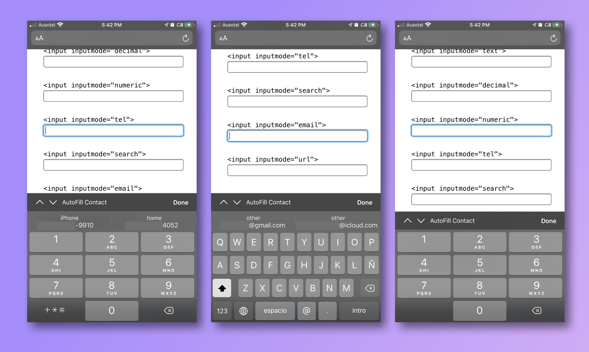

HTML inputmode attribute usage example

📱 Better mobile user experiences on form inputs with inputmode attribute. Why are you not using it?

Here an example, use a mobile to see it in action!   
[https://diegoguevara.dev/inputMode/index.html](https://diegoguevara.dev/inputMode/index.html)